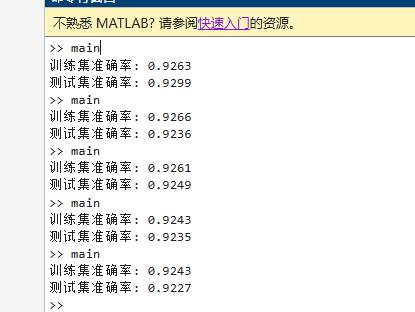

# LDA多分类问题实验报告

> @ 陈万祺 3220102895  
## 1. 作业要求
使用 MATLAB 实现 LDA 多分类问题。

需要提交代码文件
- `generate_stamps.m`
- `fit_lda.m`
- `test_lda.m`
- `main.m`

## 2. 实验设计

### 2.1 数据生成

- **特征维度**：$M = 3$
- **类别数**：$K = 3$
- **训练样本数**：2000
- **测试样本数**：1000

各类别均值向量设置为：
- 类别0：$\mu_0 = [0, 0, 0]^T$
- 类别1：$\mu_1 = [3, 0, 0]^T$  
- 类别2：$\mu_2 = [0, 3, 0]^T$

共同协方差矩阵设置为：
$$\Sigma = \begin{bmatrix}
1.0 & 0.3 & 0.1 \\
0.3 & 1.0 & 0.2 \\
0.1 & 0.2 & 1.0
\end{bmatrix}$$

### 2.2 算法实现

实现了四个核心函数：

1. **`generate_stamps.m`**：生成多维多分类的高斯分布数据
2. **`fit_lda.m`**：估计LDA模型参数
3. **`test_lda.m`**：使用判别函数进行分类预测
4. **`main.m`**：主程序，执行完整的训练和测试流程

## 3. 实验结果

### 3.1 运行结果截图




### 3.2 性能分析

为了验证算法的稳定性和可靠性，进行了五次独立测试，结果如下：

| 测试次数 | 训练集准确率 | 测试集准确率 |
|---------|-------------|-------------|
| 第1次   | 92.63%      | 92.99%      |
| 第2次   | 92.66%      | 92.36%      |
| 第3次   | 92.61%      | 92.49%      |
| 第4次   | 92.43%      | 92.35%      |
| 第5次   | 92.43%      | 92.27%      |
| **平均值** | **92.55%** | **92.49%** |
| **标准差** | **0.11%**   | **0.28%**   |


**结果分析**：
平均92.55% ± 0.11%；平均92.49% ± 0.28%；训练集和测试集准确率的标准差都很小（< 0.3%），说明算法性能稳定；训练集和测试集准确率平均相差仅0.06%，表明模型泛化能力良好。五次测试平均准确率超过92%，表明LDA模型在该多维多分类问题上表现优秀；训练集和测试集准确率非常接近且稳定，说明模型没有过拟合，具有良好的泛化能力；多次测试结果的标准差很小，验证了算法实现的稳定性和可靠性；验证了多维多分类LDA算法实现的正确性


## 4. 附录

- generate_stamps.m
```python
function data = generate_stamps(N)
    % 生成多维多分类的高斯分布数据
    % N: 总样本数
    
    % 参数设置
    M = 3;  % 特征维度
    K = 3;  % 类别数
    
    % 设置各类别的均值向量
    mu = [0, 0, 0;      % 类别0
          3, 0, 0;      % 类别1  
          0, 3, 0];     % 类别2
    
    % 共同协方差矩阵（正定）
    Sigma = [1.0, 0.3, 0.1;
             0.3, 1.0, 0.2;
             0.1, 0.2, 1.0];

    samples_per_class = floor(N / K);
    
    data = [];
    
    for k = 1:K
        X_k = mvnrnd(mu(k, :), Sigma, samples_per_class);
        Y_k = (k-1) * ones(samples_per_class, 1);  
        
        data = [data; X_k, Y_k];
    end

    perm = randperm(size(data, 1));
    data = data(perm, :);
end
```

- fit_lda.m
```python
function param = fit_lda(data)
    % 多维多分类LDA参数估计
    X = data(:, 1:end-1);  
    Y = data(:, end);     
    
    [N, M] = size(X);
    K = length(unique(Y));  
    
    % 估计各类别均值
    mu = zeros(K, M);
    p = zeros(K, 1);
    
    for k = 1:K
        class_k = (Y == k-1);  
        mu(k, :) = mean(X(class_k, :));
        p(k) = sum(class_k) / N;  
    end
    
    % 估计共同协方差矩阵
    S = zeros(M, M);
    for k = 1:K
        class_k = (Y == k-1);
        X_k = X(class_k, :);
        X_centered = X_k - mu(k, :);
        S = S + X_centered' * X_centered;
    end
    Sigma = S / (N - K);
    
    param.mu = mu;
    param.Sigma = Sigma;
    param.p = p;
    param.K = K;
    param.M = M;
end
```

- test_lda.m
```python
function pred = test_lda(X, param)
    % 多维多分类LDA预测函数
    % X: N×M特征矩阵
    % param: fit_lda返回的参数结构体
    
    [N, M] = size(X);
    K = param.K;
    pred = zeros(N, 1);
    
    Sigma_inv = inv(param.Sigma);
    
    for i = 1:N
        x = X(i, :)';  % 当前样本
        scores = zeros(K, 1);
        
        for k = 1:K
            mu_k = param.mu(k, :)';
            % 判别函数 δ_k(x)
            scores(k) = x' * Sigma_inv * mu_k - 0.5 * mu_k' * Sigma_inv * mu_k + log(param.p(k));
        end
        
        [~, max_idx] = max(scores);
        pred(i) = max_idx - 1;  % 标签从0开始
    end
end
```

- main.m
```python
% 多维多分类LDA实验
train_len = 2000;
test_len = 1000;

% 生成训练数据
train_data = generate_stamps(train_len);
X_train = train_data(:, 1:end-1);
Y_train = train_data(:, end);

% 训练LDA模型
param = fit_lda(train_data);

% 在训练集上测试
train_pred = test_lda(X_train, param);
train_acc = sum(train_pred == Y_train) / train_len;
fprintf('训练集准确率: %.4f\n', train_acc);

% 生成测试数据
test_data = generate_stamps(test_len);
X_test = test_data(:, 1:end-1);
Y_test = test_data(:, end);

% 在测试集上测试
test_pred = test_lda(X_test, param);
test_acc = sum(test_pred == Y_test) / test_len;
fprintf('测试集准确率: %.4f\n', test_acc);
```