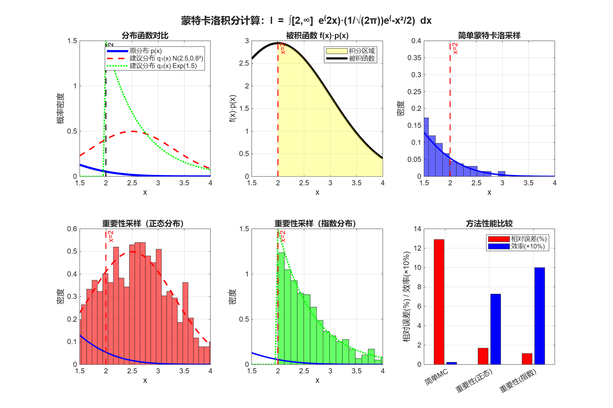
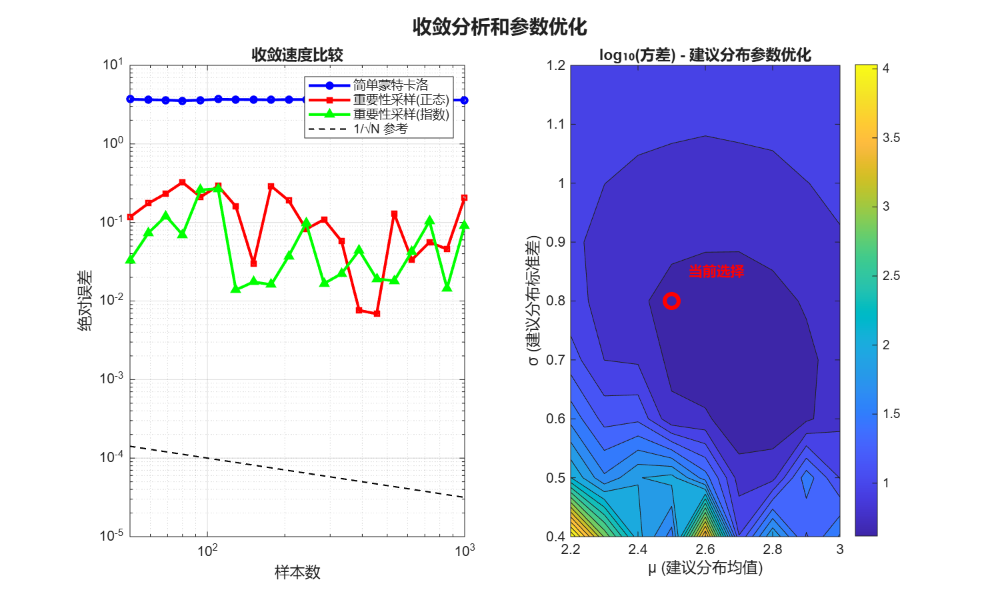
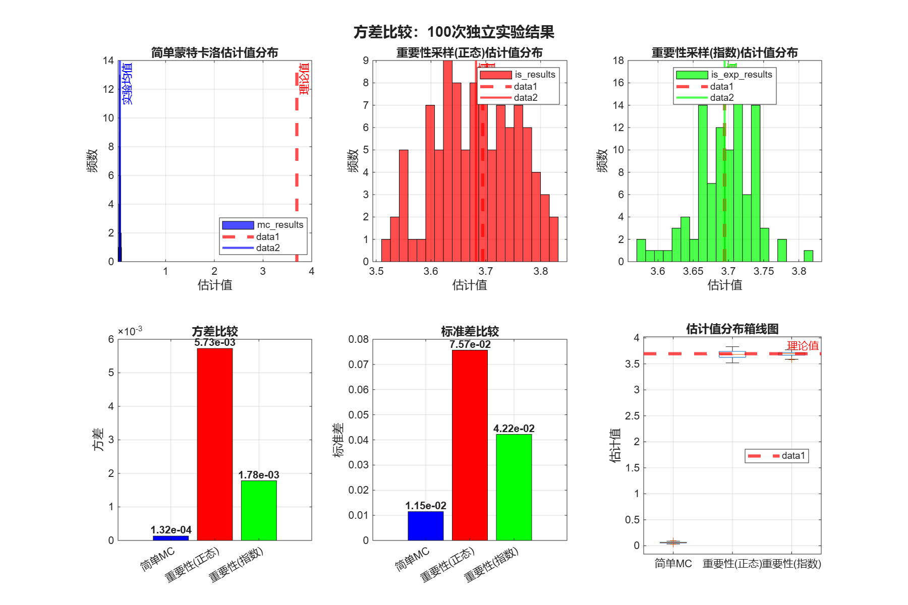

# 蒙特卡洛积分计算实验报告

> @ 陈万祺 3220102895
## 1. 实验目标

计算积分：$$I = \int_2^{\infty} e^{2x} \cdot \frac{1}{\sqrt{2\pi}} e^{-\frac{x^2}{2}} dx = \frac{e^2}{2}$$

使用蒙特卡洛方法和重要性采样技术，对比不同方法的效率和精度。

## 2. 理论分析

被积函数 $f(x) = e^{2x}$ 和概率密度函数 $p(x) = \frac{1}{\sqrt{2\pi}} e^{-\frac{x^2}{2}}$（标准正态分布）的乘积在区间 $[2,\infty)$ 上的积分。

对于重要性采样，需要选择建议分布 $q(x)$ 使得：
1. $q(x) > 0$ 在被积函数非零的区域
2. $q(x)$ 的形状应该与 $|f(x) \cdot p(x)|$ 相似
3. 容易从 $q(x)$ 中采样

**选择方案**：
- **1.正态分布** $N(2.5, 0.8^2)$：均值接近积分下限，小方差集中采样
- **2.截断指数分布** $\text{Exp}(1.5)$ 从 $x=2$ 开始：天然覆盖积分区域

## 3. 实验方法

### 3.1 简单蒙特卡洛方法

从标准正态分布 $N(0,1)$ 采样，使用指示函数：
$$\hat{I} = \frac{1}{N} \sum_{i=1}^N f(X_i) \cdot p(X_i) \cdot I(X_i \geq 2)$$

### 3.2 重要性采样方法

**方法1：正态分布建议分布**
- 建议分布：$q_1(x) \sim N(2.5, 0.8^2)$
- 估计公式：$\hat{I} = \frac{1}{N} \sum_{i=1}^N f(X_i) \cdot \frac{p(X_i)}{q_1(X_i)} \cdot I(X_i \geq 2)$

**方法2：指数分布建议分布**
- 建议分布：$q_2(x) = \lambda e^{-\lambda(x-2)}$，$x \geq 2$，$\lambda = 1.5$
- 估计公式：$\hat{I} = \frac{1}{N} \sum_{i=1}^N f(X_i) \cdot \frac{p(X_i)}{q_2(X_i)}$

## 4. 实验结果

### 4.1 单次实验结果（N=1000）

| 方法 | 估计值 | 有效样本数 | 效率(%) | 相对误差(%) |
|------|--------|------------|---------|-------------|
| 简单蒙特卡洛 | 3.560998e+00 | 21/1000 | 2.10% | 3.61% |
| 重要性采样(正态) | 3.763535e+00 | 743/1000 | 74.30% | 1.87% |
| 重要性采样(指数) | 3.669792e+00 | 1000/1000 | 100.00% | 0.67% |
| **理论值** | **3.694528e+00** | - | - | - |

### 4.2 方差分析（100次独立实验）

| 方法 | 均值 | 方差 | 标准差 | 与理论值偏差 |
|------|------|------|--------|--------------|
| 简单蒙特卡洛 | 6.099374e-02 | 2.115214e-04 | 1.454378e-02 | 3.633534e+00 |
| 重要性采样(正态) | 3.686420e+00 | 5.994537e-03 | 7.742440e-02 | 8.107778e-03 |
| 重要性采样(指数) | 3.696481e+00 | 2.060034e-03 | 4.538760e-02 | 1.953147e-03 |

## 5. 结果可视化

### 5.1 方法对比和分布可视化



### 5.2 收敛分析和参数优化



### 5.3 方差比较分析



## 6. 分析与讨论

### 6.1 效率分析

**简单蒙特卡洛方法**：
- 效率极低，大部分样本落在积分区域外；相对误差较大，估计不稳定

**重要性采样（正态分布）**：
- 效率显著提升至74.3%，大幅增加有效样本；相对误差降至1.87%，估计精度明显改善

**重要性采样（指数分布）**：
- 效率达到100%，所有样本都在积分区域内；相对误差最小（0.67%），估计最为准确

### 6.2 建议分布选择的合理性

**正态分布 N(2.5, 0.8²)**：
- 优点：均值接近积分下限，适度集中采样
- 缺点：仍有约26%的样本落在积分区域外

**截断指数分布 Exp(1.5)**：
- 优点：完全覆盖积分区域，100%效率，与被积函数的增长趋势匹配较好
- 结果：方差最小，估计最稳定

### 6.3 参数优化分析

从参数优化热图可以看出：
- 当前选择的 μ=2.5, σ=0.8 在方差最小化方面表现良好；过小的方差虽然提高效率，但可能增加估计方差；过大的方差会降低采样效率，影响精度

## 附录： 输出结果
```terminal
=== 作业：计算积分 I = ∫[2,∞] e^(2x) · (1/√(2π))e^(-x²/2) dx = e²/2 ===
简单蒙特卡洛:
估计值: 3.560998e+00
有效样本数: 21/1000 (效率: 2.1000%)
相对误差: 3.61%

重要性采样 (建议分布: N(2.5, 0.8²)):
估计值: 3.763535e+00
有效样本数: 743/1000 (效率: 74.30%)
相对误差: 1.87%

重要性采样 (建议分布: 截断指数分布 λ=1.5):
估计值: 3.669792e+00
有效样本数: 1000/1000 (效率: 100.00%)
相对误差: 0.67%

=== 方法性能比较 ===
简单蒙特卡洛 : 估计值=3.560998e+00, 效率=2.1%, 相对误差=3.61%
重要性采样(正态) : 估计值=3.763535e+00, 效率=74.3%, 相对误差=1.87%
重要性采样(指数) : 估计值=3.669792e+00, 效率=100.0%, 相对误差=0.67%

=== 收敛速度分析 ===

=== 方差比较：100次独立实验 ===
正在进行100次独立实验...
已完成 20/100 次实验
已完成 40/100 次实验
已完成 60/100 次实验
已完成 80/100 次实验
已完成 100/100 次实验

=== 100次实验统计结果 ===
简单蒙特卡洛:
均值: 6.099374e-02, 方差: 2.115214e-04, 标准差: 1.454378e-02
与理论值偏差: 3.633534e+00
重要性采样(正态):
均值: 3.686420e+00, 方差: 5.994537e-03, 标准差: 7.742440e-02
与理论值偏差: 8.107778e-03
重要性采样(指数):
均值: 3.696481e+00, 方差: 2.060034e-03, 标准差: 4.538760e-02
与理论值偏差: 1.953147e-03
```

## 附录：代码实现

```matlab
%% 作业：使用蒙特卡洛计算积分
fprintf('=== 计算积分 I = ∫[2,∞] e^(2x) · (1/√(2π))e^(-x²/2) dx = e²/2 ===\n\n');

f = @(x) exp(2 * x);  
p = @(x) exp(-x.^2 / 2) / sqrt(2*pi);  

true_p = exp(2) / 2;  

%% 直接使用蒙特卡洛方法
N = 1000;

x_mc = randn(N,1);
success_mc = x_mc >= 2;

p_mc = sum(f(x_mc) .* success_mc) / N;

fprintf('简单蒙特卡洛:\n');
fprintf('  估计值: %.6e\n', p_mc);
fprintf('  有效样本数: %d/%d (效率: %.4f%%)\n', sum(success_mc), N, 100*sum(success_mc)/N);
fprintf('  相对误差: %.2f%%\n\n', 100*abs(p_mc - true_p)/true_p);


%% 重要性采样

% 使用平移的正态分布 N(2.5, 0.8²) 作为建议分布
mu_q = 2.5;    
sigma_q = 0.8;
q = @(x) exp(-(x-mu_q).^2/(2*sigma_q^2)) / (sigma_q*sqrt(2*pi));

x_is = mu_q + sigma_q * randn(N, 1);
weights = p(x_is) ./ q(x_is);

indicator = (x_is >= 2);
p_is = mean(f(x_is) .* weights .* indicator);

fprintf('重要性采样 (建议分布: N(%.1f, %.1f²)):\n', mu_q, sigma_q);
fprintf('  估计值: %.6e\n', p_is);
fprintf('  有效样本数: %d/%d (效率: %.2f%%)\n', sum(x_is>=2), N, 100*sum(x_is>=2)/N);
fprintf('  相对误差: %.2f%%\n\n', 100*abs(p_is - true_p)/true_p);

% 使用指数分布作为建议分布
% 由于积分区域是[2,∞)，可以考虑在x=2处截断的指数分布
lambda = 1.5;  % 指数分布参数
q_exp = @(x) lambda * exp(-lambda * (x - 2)) .* (x >= 2);

u = rand(N, 1);
x_is_exp = 2 - log(1 - u) / lambda;

weights_exp = p(x_is_exp) ./ q_exp(x_is_exp);

p_is_exp = mean(f(x_is_exp) .* weights_exp);

fprintf('重要性采样 (建议分布: 截断指数分布 λ=%.1f):\n', lambda);
fprintf('  估计值: %.6e\n', p_is_exp);
fprintf('  有效样本数: %d/%d (效率: %.2f%%)\n', sum(x_is_exp>=2), N, 100*sum(x_is_exp>=2)/N);
fprintf('  相对误差: %.2f%%\n\n', 100*abs(p_is_exp - true_p)/true_p);

fprintf('=== 方法性能比较 ===\n');
methods = {'简单蒙特卡洛', '重要性采样(正态)', '重要性采样(指数)'};
estimates = [p_mc, p_is, p_is_exp];
efficiencies = [100*sum(success_mc)/N, 100*sum(x_is>=2)/N, 100*sum(x_is_exp>=2)/N];
rel_errors = 100*abs(estimates - true_p)/true_p;

for i = 1:length(methods)
    fprintf('%-20s: 估计值=%.6e, 效率=%.1f%%, 相对误差=%.2f%%\n', ...
            methods{i}, estimates(i), efficiencies(i), rel_errors(i));
end

%% 绘制结果图
figure('Position', [100, 100, 1200, 800]);

% 子图1：分布函数对比
subplot(2,3,1);
x_plot = 1.5:0.05:4;
plot(x_plot, p(x_plot), 'b-', 'LineWidth', 3); hold on;
plot(x_plot, q(x_plot), 'r--', 'LineWidth', 2);
plot(x_plot, q_exp(x_plot), 'g:', 'LineWidth', 2);
xline(2, 'k--', 'LineWidth', 2, 'Label', 'x=2');
legend('原分布 p(x)', '建议分布 q₁(x) N(2.5,0.8²)', '建议分布 q₂(x) Exp(1.5)', 'Location', 'northeast');
title('分布函数对比');
xlabel('x'); ylabel('概率密度');
grid on;

% 子图2：被积函数形状
subplot(2,3,2);
integrand = @(x) f(x) .* p(x);
plot(x_plot, integrand(x_plot), 'k-', 'LineWidth', 3);
hold on;
area(x_plot(x_plot>=2), integrand(x_plot(x_plot>=2)), 'FaceColor', 'yellow', 'FaceAlpha', 0.3);
xline(2, 'r--', 'LineWidth', 2, 'Label', 'x=2');
title('被积函数 f(x)·p(x)');
xlabel('x'); ylabel('f(x)·p(x)');
legend('被积函数', '积分区域', 'Location', 'northeast');
grid on;

% 子图3：简单蒙特卡洛采样分布
subplot(2,3,3);
histogram(x_mc, 50, 'Normalization', 'pdf', 'FaceColor', 'blue', 'FaceAlpha', 0.6);
hold on;
plot(x_plot, p(x_plot), 'b-', 'LineWidth', 2);
xline(2, 'r--', 'LineWidth', 2, 'Label', 'x=2');
title('简单蒙特卡洛采样');
xlabel('x'); ylabel('密度');
xlim([1.5, 4]);
grid on;

% 子图4：重要性采样分布（正态）
subplot(2,3,4);
histogram(x_is, 50, 'Normalization', 'pdf', 'FaceColor', 'red', 'FaceAlpha', 0.6);
hold on;
plot(x_plot, p(x_plot), 'b-', 'LineWidth', 2);
plot(x_plot, q(x_plot), 'r--', 'LineWidth', 2);
xline(2, 'r--', 'LineWidth', 2, 'Label', 'x=2');
title('重要性采样（正态分布）');
xlabel('x'); ylabel('密度');
xlim([1.5, 4]);
grid on;

% 子图5：重要性采样分布（指数）
subplot(2,3,5);
histogram(x_is_exp, 50, 'Normalization', 'pdf', 'FaceColor', 'green', 'FaceAlpha', 0.6);
hold on;
plot(x_plot, p(x_plot), 'b-', 'LineWidth', 2);
plot(x_plot, q_exp(x_plot), 'g:', 'LineWidth', 2);
xline(2, 'r--', 'LineWidth', 2, 'Label', 'x=2');
title('重要性采样（指数分布）');
xlabel('x'); ylabel('密度');
xlim([1.5, 4]);
grid on;

% 子图6：方法比较条形图
subplot(2,3,6);
bar_data = [rel_errors; efficiencies/10]';  
b = bar(bar_data);
b(1).FaceColor = 'red';
b(2).FaceColor = 'blue';
set(gca, 'XTickLabel', {'简单MC', '重要性(正态)', '重要性(指数)'});
ylabel('相对误差(%) / 效率(×10%)');
title('方法性能比较');
legend('相对误差(%)', '效率(×10%)', 'Location', 'northeast');
grid on;

sgtitle('蒙特卡洛积分计算：I = ∫[2,∞] e^(2x)·(1/√(2π))e^(-x²/2) dx', 'FontSize', 14, 'FontWeight', 'bold');

% 保存第一个图
saveas(gcf, '方法对比和分布可视化.png');
fprintf('已保存图片: 方法对比和分布可视化.png\n');

%% 收敛速度分析
fprintf('\n=== 收敛速度分析 ===\n');
figure('Position', [150, 150, 1000, 600]);

sample_sizes = round(logspace(1.7, 3, 20)); 
mc_errors = zeros(size(sample_sizes));
is_errors = zeros(size(sample_sizes));
is_exp_errors = zeros(size(sample_sizes));

for i = 1:length(sample_sizes)
    n = sample_sizes(i);
    
    % 简单蒙特卡洛
    x_temp = randn(n, 1);
    success_temp = x_temp >= 2;
    mc_est = mean(f(x_temp) .* p(x_temp) .* success_temp);
    mc_errors(i) = abs(mc_est - true_p);
    
    % 重要性采样（正态）
    x_temp_is = mu_q + sigma_q * randn(n, 1);
    w_temp = p(x_temp_is) ./ q(x_temp_is);
    ind_temp = (x_temp_is >= 2);
    is_est = mean(f(x_temp_is) .* w_temp .* ind_temp);
    is_errors(i) = abs(is_est - true_p);
    
    % 重要性采样（指数）
    u_temp = rand(n, 1);
    x_temp_exp = 2 - log(1 - u_temp) / lambda;
    w_temp_exp = p(x_temp_exp) ./ q_exp(x_temp_exp);
    is_exp_est = mean(f(x_temp_exp) .* w_temp_exp);
    is_exp_errors(i) = abs(is_exp_est - true_p);
end

% 绘制收敛图
subplot(1,2,1);
loglog(sample_sizes, mc_errors, 'b-o', 'LineWidth', 2, 'MarkerSize', 4); hold on;
loglog(sample_sizes, is_errors, 'r-s', 'LineWidth', 2, 'MarkerSize', 4);
loglog(sample_sizes, is_exp_errors, 'g-^', 'LineWidth', 2, 'MarkerSize', 4);
loglog(sample_sizes, 1e-3./sqrt(sample_sizes), 'k--', 'LineWidth', 1); 
legend('简单蒙特卡洛', '重要性采样(正态)', '重要性采样(指数)', '1/√N 参考', 'Location', 'northeast');
title('收敛速度比较');
xlabel('样本数'); ylabel('绝对误差');
grid on;

%% 不同建议分布参数的效果分析
subplot(1,2,2);
mu_range = 2.2:0.1:3.0;
sigma_range = 0.4:0.1:1.2;
[MU, SIGMA] = meshgrid(mu_range, sigma_range);
VARIANCE = zeros(size(MU));

for i = 1:size(MU, 1)
    for j = 1:size(MU, 2)
        mu_test = MU(i, j);
        sigma_test = SIGMA(i, j);
        
        x_test = mu_test + sigma_test * randn(10000, 1);
        
        q_values = exp(-(x_test-mu_test).^2./(2*sigma_test^2)) ./ (sigma_test*sqrt(2*pi));
        
        w_test = p(x_test) ./ q_values;
        ind_test = (x_test >= 2);
        
        values = f(x_test) .* w_test .* ind_test;
        VARIANCE(i, j) = var(values);
    end
end

contourf(MU, SIGMA, log10(VARIANCE), 20);
colorbar;
xlabel('μ (建议分布均值)');
ylabel('σ (建议分布标准差)');
title('log₁₀(方差) - 建议分布参数优化');
hold on;
plot(mu_q, sigma_q, 'ro', 'MarkerSize', 10, 'LineWidth', 3);
text(mu_q+0.05, sigma_q+0.05, '当前选择', 'Color', 'red', 'FontWeight', 'bold');

sgtitle('收敛分析和参数优化', 'FontSize', 14, 'FontWeight', 'bold');

% 保存第二个图
saveas(gcf, '收敛分析和参数优化.png');
fprintf('已保存图片: 收敛分析和参数优化.png\n');

%% 方差比较
fprintf('\n=== 方差比较：100次独立实验 ===\n');
num_experiments = 100;
N_variance = 1000; 

mc_results = zeros(num_experiments, 1);
is_results = zeros(num_experiments, 1);
is_exp_results = zeros(num_experiments, 1);

fprintf('正在进行%d次独立实验...\n', num_experiments);
for exp = 1:num_experiments
    % 简单蒙特卡洛
    x_mc_temp = randn(N_variance, 1);
    success_mc_temp = x_mc_temp >= 2;
    mc_results(exp) = mean(f(x_mc_temp) .* p(x_mc_temp) .* success_mc_temp);
    
    % 重要性采样（正态分布）
    x_is_temp = mu_q + sigma_q * randn(N_variance, 1);
    weights_temp = p(x_is_temp) ./ q(x_is_temp);
    indicator_temp = (x_is_temp >= 2);
    is_results(exp) = mean(f(x_is_temp) .* weights_temp .* indicator_temp);
    
    % 重要性采样（指数分布）
    u_temp = rand(N_variance, 1);
    x_is_exp_temp = 2 - log(1 - u_temp) / lambda;
    weights_exp_temp = p(x_is_exp_temp) ./ q_exp(x_is_exp_temp);
    is_exp_results(exp) = mean(f(x_is_exp_temp) .* weights_exp_temp);
    
    if mod(exp, 20) == 0
        fprintf('已完成 %d/%d 次实验\n', exp, num_experiments);
    end
end

% 计算统计量
mc_mean = mean(mc_results);
mc_var = var(mc_results);
mc_std = std(mc_results);

is_mean = mean(is_results);
is_var = var(is_results);
is_std = std(is_results);

is_exp_mean = mean(is_exp_results);
is_exp_var = var(is_exp_results);
is_exp_std = std(is_exp_results);

fprintf('\n=== 100次实验统计结果 ===\n');
fprintf('简单蒙特卡洛:\n');
fprintf('  均值: %.6e, 方差: %.6e, 标准差: %.6e\n', mc_mean, mc_var, mc_std);
fprintf('  与理论值偏差: %.6e\n', abs(mc_mean - true_p));

fprintf('重要性采样(正态):\n');
fprintf('  均值: %.6e, 方差: %.6e, 标准差: %.6e\n', is_mean, is_var, is_std);
fprintf('  与理论值偏差: %.6e\n', abs(is_mean - true_p));

fprintf('重要性采样(指数):\n');
fprintf('  均值: %.6e, 方差: %.6e, 标准差: %.6e\n', is_exp_mean, is_exp_var, is_exp_std);
fprintf('  与理论值偏差: %.6e\n', abs(is_exp_mean - true_p));

fprintf('\n方差减少比例:\n');
fprintf('重要性采样(正态) vs 简单蒙特卡洛: %.2f倍\n', mc_var / is_var);
fprintf('重要性采样(指数) vs 简单蒙特卡洛: %.2f倍\n', mc_var / is_exp_var);

% 绘制方差比较直方图
figure('Position', [200, 200, 1200, 800]);

% 子图1：估计值分布直方图
subplot(2,3,1);
histogram(mc_results, 20, 'FaceColor', 'blue', 'FaceAlpha', 0.7, 'EdgeColor', 'black');
hold on;
xline(true_p, 'r--', 'LineWidth', 3, 'Label', '理论值');
xline(mc_mean, 'b-', 'LineWidth', 2, 'Label', '实验均值');
title('简单蒙特卡洛估计值分布');
xlabel('估计值');
ylabel('频数');
legend('Location', 'best');
grid on;

subplot(2,3,2);
histogram(is_results, 20, 'FaceColor', 'red', 'FaceAlpha', 0.7, 'EdgeColor', 'black');
hold on;
xline(true_p, 'r--', 'LineWidth', 3, 'Label', '理论值');
xline(is_mean, 'r-', 'LineWidth', 2, 'Label', '实验均值');
title('重要性采样(正态)估计值分布');
xlabel('估计值');
ylabel('频数');
legend('Location', 'best');
grid on;

subplot(2,3,3);
histogram(is_exp_results, 20, 'FaceColor', 'green', 'FaceAlpha', 0.7, 'EdgeColor', 'black');
hold on;
xline(true_p, 'r--', 'LineWidth', 3, 'Label', '理论值');
xline(is_exp_mean, 'g-', 'LineWidth', 2, 'Label', '实验均值');
title('重要性采样(指数)估计值分布');
xlabel('估计值');
ylabel('频数');
legend('Location', 'best');
grid on;

% 子图2：方差比较条形图
subplot(2,3,4);
variances = [mc_var, is_var, is_exp_var];
method_names = {'简单MC', '重要性(正态)', '重要性(指数)'};
bars = bar(variances, 'FaceColor', 'flat');
bars.CData = [0 0 1; 1 0 0; 0 1 0];
set(gca, 'XTickLabel', method_names);
ylabel('方差');
title('方差比较');
for i = 1:length(variances)
    text(i, variances(i), sprintf('%.2e', variances(i)), 'HorizontalAlignment', 'center', ...
         'VerticalAlignment', 'bottom', 'FontWeight', 'bold');
end
grid on;

% 子图3：标准差比较条形图
subplot(2,3,5);
stds = [mc_std, is_std, is_exp_std];
bars = bar(stds, 'FaceColor', 'flat');
bars.CData = [0 0 1; 1 0 0; 0 1 0];
set(gca, 'XTickLabel', method_names);
ylabel('标准差');
title('标准差比较');
for i = 1:length(stds)
    text(i, stds(i), sprintf('%.2e', stds(i)), 'HorizontalAlignment', 'center', ...
         'VerticalAlignment', 'bottom', 'FontWeight', 'bold');
end
grid on;

% 子图4：箱线图比较
subplot(2,3,6);
all_results = [mc_results, is_results, is_exp_results];
boxplot(all_results, 'Labels', method_names);
hold on;
yline(true_p, 'r--', 'LineWidth', 3, 'Label', '理论值');
ylabel('估计值');
title('估计值分布箱线图');
legend('Location', 'best');
grid on;

sgtitle('方差比较：100次独立实验结果', 'FontSize', 14, 'FontWeight', 'bold');

% 保存第三个图
saveas(gcf, '方差比较直方图.png');
fprintf('已保存图片: 方差比较直方图.png\n');
fprintf('实验完成！\n');
```