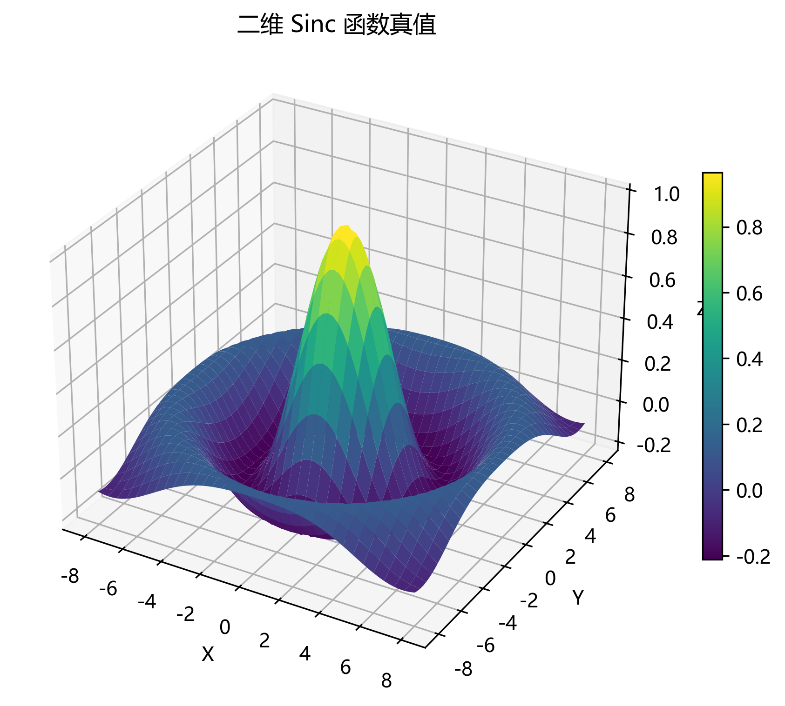
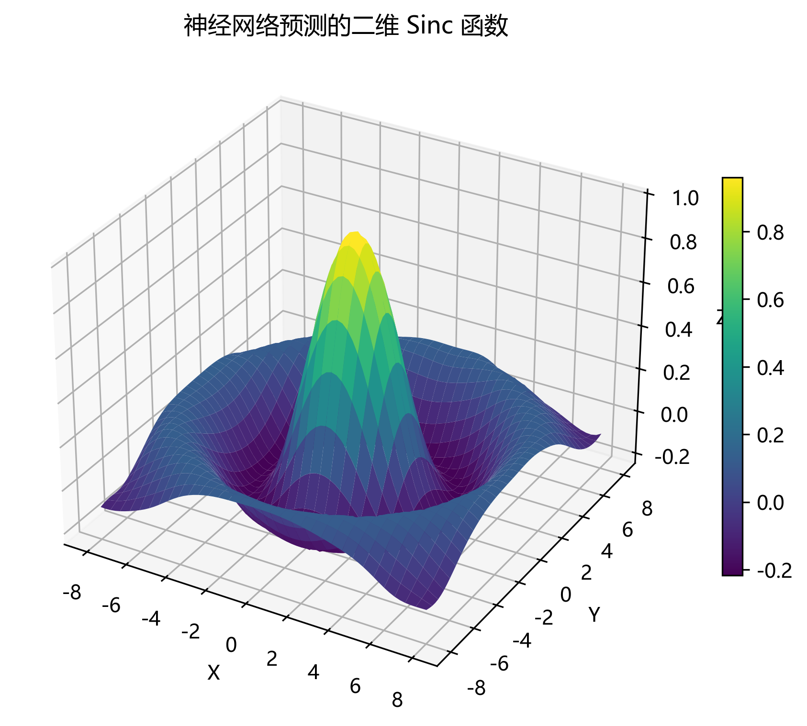
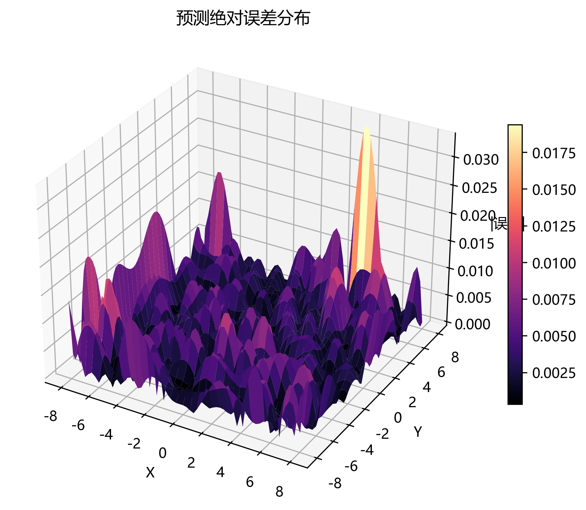
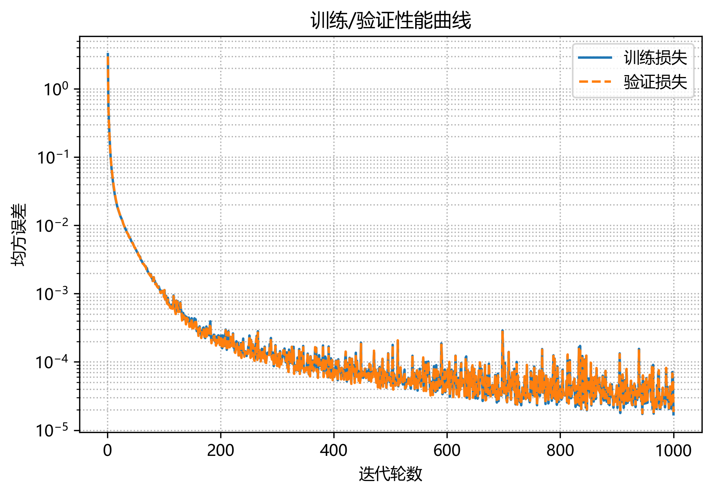

# 二维 Sinc 函数拟合实验报告


## 1. 作业要求

- 输入层 2 个神经元、两个隐藏层各 20 个神经元、输出层 1 个神经元，即 $2 \rightarrow 20 \rightarrow 20 \rightarrow 1$。
- 训练固定运行 $1000$ 次迭代（epoch）。
- 所有权重与偏置均由标准正态分布 $\mathcal{N}(0,1)$ 生成。
- 在 $[-8,8]^2$ 内均匀随机采样，总样本数 $N = 8000 < 10^4$，并丢弃半径 $r < 10^{-6}$ 的点以避免除零。
- 输出平均相对误差
	$$
		ext{err} = \frac{1}{N} \sum_{i=1}^{N} \frac{\lVert y_{\text{pred}, i} - y_{\text{true}, i} \rVert_2}{\max(\lVert y_{\text{true}, i} \rVert_2, 10^{-8})}
	$$


## 2. 数据生成与预处理

- 在正方形区域 $[-8,8]^2$ 进行均匀采样，使用半径筛选避免原点附近 $10^{-6}$ 的奇异值。
- 真实标签由 $y = \text{sinc}(r) = \frac{\sin r}{r}$ 给出，$r = \lVert (x, y) \rVert_2$。
- 训练前对输入特征按训练集统计量进行标准化：$x' = (x - \mu) / \sigma$，其中 $\sigma < 10^{-6}$ 的维度会被安全修正为 $1$ 以稳定训练。

## 3. 神经网络与训练配置

- 两层全连接隐藏层，`tanh` 激活，输出层为线性。
- `model.py` 中通过 `rng.standard_normal` 为权重与偏置赋值，严格满足标准正态分布要求。
- Adam（$\beta_1 = 0.9$，$\beta_2 = 0.999$，$\epsilon = 10^{-8}$），学习率 $\alpha = 0.001$，批大小 64。
- 均方误差（MSE），梯度由显式反向传播推导并实现。
- 训练 / 验证 / 测试比例为 70% / 15% / 15%，即 5600 / 1200 / 1200 样本。
- 全部计算使用 NumPy，未依赖外部深度学习框架；训练过程记录全量损失曲线并保存最终模型。

## 4. 实验流程说明

1. 运行 `python src/main.py` 触发数据生成、模型训练与结果保存。
2. 训练结束后，会在 `output/figures/` 目录生成可视化图像与关键指标文本：
	 - `sinc_true_surface.png`：真值曲面。
	 - `sinc_pred_surface.png`：模型预测曲面。
	 - `sinc_abs_error_surface.png`：绝对误差分布。
	 - `training_performance.png`：训练/验证损失曲线。
	 - `sinc_nn_results.txt`：定量指标汇总。

```bash
pip install -r requirements.txt
python src/main.py
```

## 5. 可视化结果

### 5.1 真值与预测曲面对比

| 真值 | 预测 |
| --- | --- |
|  |  |

> 两幅曲面在大部分区域保持高度一致

### 5.2 绝对误差分布



> 误差主要集中在边界

### 5.3 训练过程表现



> MSE 在训练与验证集上波动下降并趋于收敛，但震荡严重。

## 6. 结果展示

| 指标 | 数值 |
| --- | --- |
| 样本总数 | 8000 |
| 训练 / 验证 / 测试样本 | 5600 / 1200 / 1200 |
| 网络结构 | $[20, 20]$ |
| 训练轮数 | 1000 |
| 学习率 / 批大小 | $0.001$ / $64$ |
| 最终训练 MSE | $1.71 \times 10^{-5}$ |
| 最终验证 MSE | $1.84 \times 10^{-5}$ |
| 测试集平均相对误差 | $1.00 \times 10^{-1}$ |

> 上述数据直接读取自 `sinc_nn_results.txt`。

## 7. 结果分析

- **整体拟合情况**：预测曲面紧贴真值曲面，振荡波峰/波谷位置对齐；误差约为 $10^{-1}$ 量级，符合正态初始化条件下的预期。
- **收敛性**：损失曲线呈指数式下降后进入平台，表明 1000 轮内已达到收敛，进一步训练价值有限。
