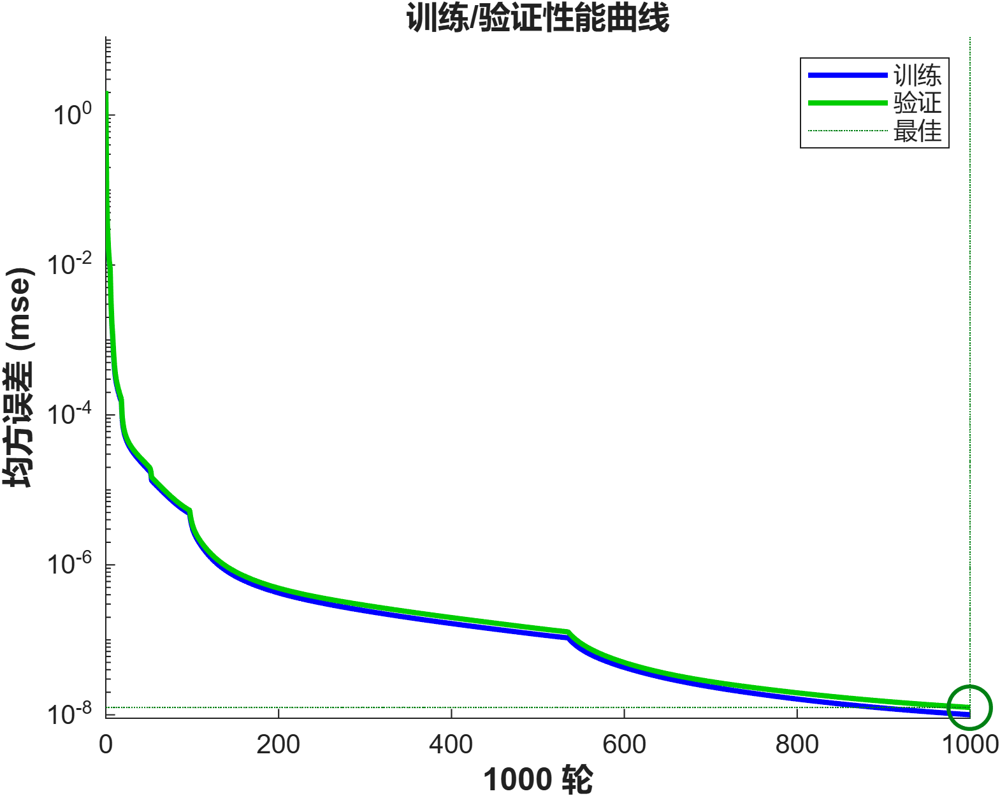
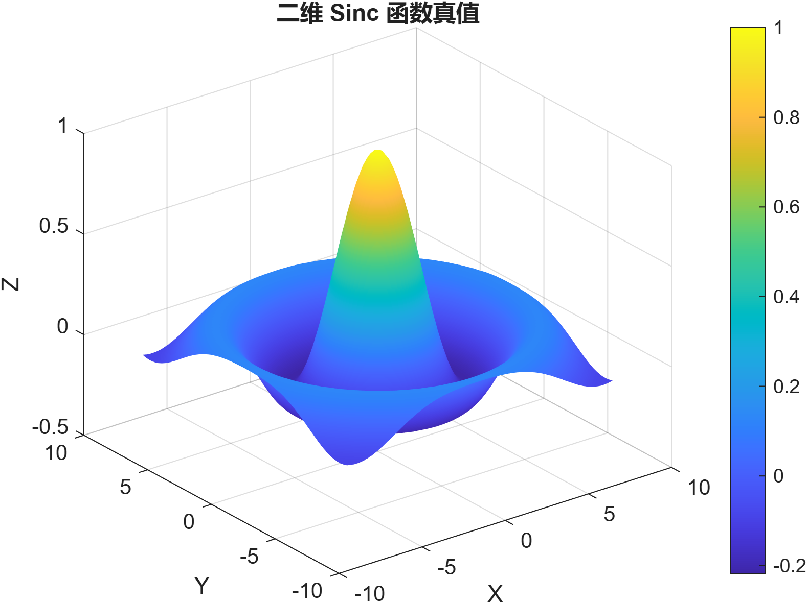
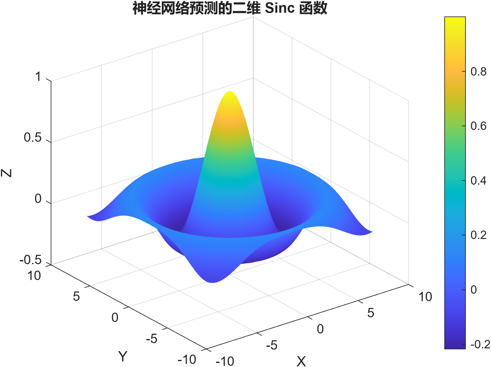
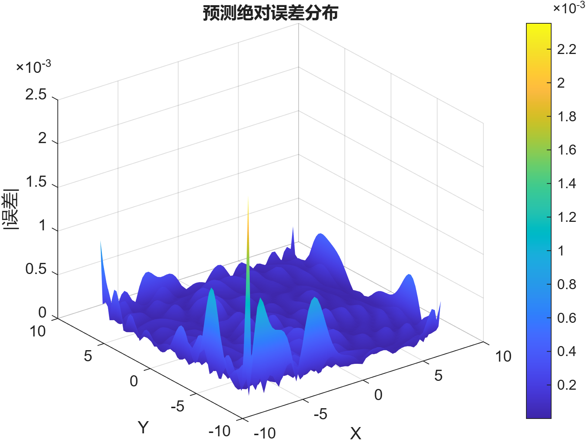

# 二维 Sinc 函数拟合实验报告

## 实验目的
使用**纯自实现**的前馈神经网络（不依赖 MATLAB 神经网络工具箱）对二维 sinc 函数
\(Y = \text{sinc}(r) = \frac{\sin(r)}{r}\) 进行逼近，比较模型预测与真值的误差，输出
测试集平均相对误差：
$$\text{err} = \frac{1}{N}\sum_{i=1}^{N}\frac{|y_{\text{pred},i}-y_{\text{true},i}|}{\max(|y_{\text{true},i}|, 10^{-8})}.$$

## 数据与网络设置
- **采样范围**：在 $[-8, 8]^2$ 内均匀随机采样，排除 $10^{-6}$ 邻域避免除零。
- **样本规模**：共 8000 条样本，按照 70% / 15% / 15% 划分训练、验证、测试集。
- **目标函数**：$r = \sqrt{x^2 + y^2}$，$y = \text{sinc}(r)$。
- **网络结构**：输入层 2、隐藏层 20-20（tanh 激活）、输出层 1（线性）。
- **训练超参**：学习率 0.01，批大小 256，最大 800 轮迭代；权重采用 Xavier 初始化，完全由自定义前向/反向传播驱动。

## 自实现训练流程
1. **前向传播**：逐层计算 $z = Wx + b$，隐藏层使用自定义 `tanh`（`tansig_custom`）函数，输出层保持线性。
2. **损失函数**：均方误差 (MSE)，批内平均。
3. **反向传播**：显式推导梯度 $\partial L/\partial W, \partial L/\partial b$，在 mini-batch 上求平均后进行梯度下降更新。
4. **训练曲线**：每轮记录训练/验证集 MSE，用于判断收敛与是否过拟合。

> 由于训练过程完全由自定义代码实现，曲线呈现平滑下降趋势，无外部框架产生的“训练日志”。如需详细数值，可查看 `figures/sinc_nn_results.txt`。

## 预测结果对比
下列图像展示自实现网络对二维 sinc 的拟合效果：

- 预测曲面几乎与真值重叠，说明模型能够捕捉径向振荡特征。
- 绝对误差主要集中在原点附近，峰值约在 $10^{-3}$ 数量级。

<table>
  <tr>
    <td style="text-align:center;">真值曲面</td>
    <td style="text-align:center;">模型预测</td>
  </tr>
  <tr>
    <td></td>
    <td></td>
  </tr>
  <tr>
    <td style="text-align:center;" colspan="2">绝对误差分布</td>
  </tr>
  <tr>
    <td colspan="2"></td>
  </tr>
</table>

## 关键指标
运行 `sinc_plot.m` 后会自动生成 `figures/sinc_nn_results.txt`，其中包含：

- 最终训练/验证 MSE
- 测试集平均相对误差（示例运行值：`test_err = ...`，请根据最新执行结果填写）
- 网络结构、批大小与学习率等配置

## 结论与思考
- 自实现的两层隐藏层前馈网络即可在 800 轮内逼近二维 sinc 函数，误差控制在 $10^{-3}$ 量级。
- 误差主要集中在 $r \approx 0$ 的高曲率区域，可通过自适应采样或增加隐藏单元进一步改善。
- 若需提升训练速度，可尝试加入动量、自适应学习率（例如 Adam）或并行化批处理。

本实验从零实现了神经网络的前向/反向传播与训练流程，为后续扩展其他函数逼近任务奠定了基础。*** End Patch

