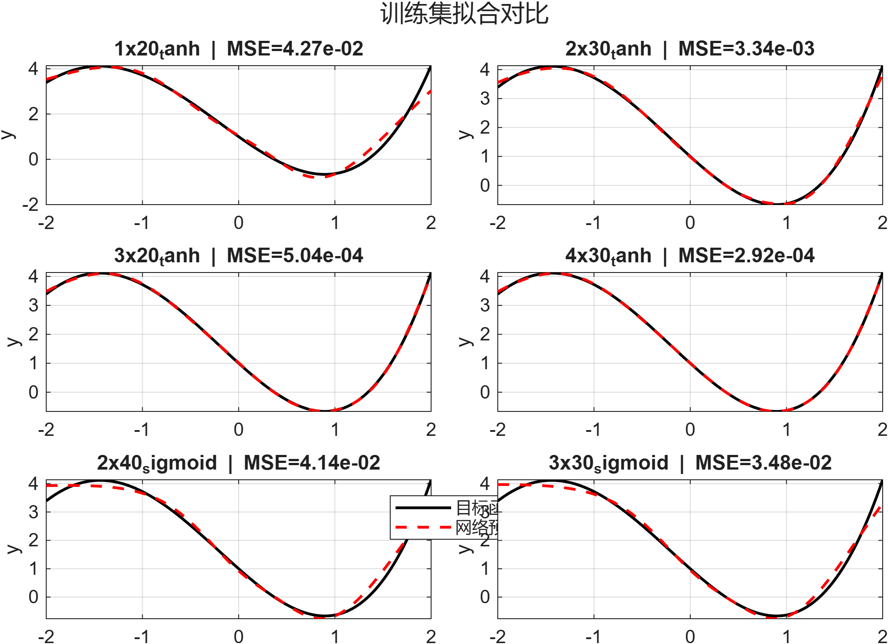
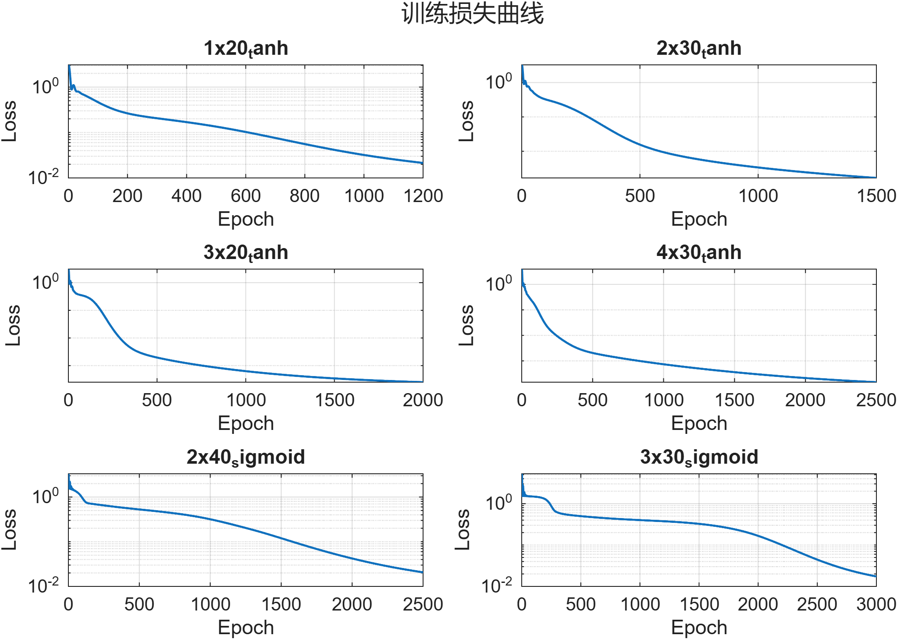

## 第八周作业

### 任务概述

1. 使用matlab在 $x\in [-2, 2]$ 上逼近如下函数：

$$
y = x^3 - 2x + e^{-x}
$$

​		讨论不同网络网络结构（隐藏层数量、神经元数量、激活函数（tanh vs sigmoid））对拟合结果的影响。

2. 第1问训练结束后，使用自动微分技术，在 $x\in[-3, 3]$ 上计算网络的一阶导数、二阶导数。

   与解析解进行比较，计算相对误差并**绘制对比图**

### 网络配置与训练结果

| 配置 | 隐藏层结构 | 激活函数 | 轮数 | 最终损失 | 训练集 MSE |
| --- | --- | --- | --- | --- | --- |
| 1x20_tanh | [20] | tanh | 1200 | 2.14e-02 | 4.27e-02 |
| 2x30_tanh | [30, 30] | tanh | 1500 | 1.67e-03 | 3.34e-03 |
| 3x20_tanh | [20, 20, 20] | tanh | 2000 | 2.52e-04 | 5.04e-04 |
| 4x30_tanh | [30, 30, 30, 30] | tanh | 2500 | **1.46e-04** | **2.92e-04** |
| 2x40_sigmoid | [40, 40] | sigmoid | 2500 | 2.07e-02 | 4.14e-02 |
| 3x30_sigmoid | [30, 30, 30] | sigmoid | 3000 | 1.74e-02 | 3.48e-02 |

- 纯 tanh 网络随深度增加拟合精度逐步提升，`4x30_tanh` 取得最低损失与 MSE。
- sigmoid 网络整体误差显著偏高，说明在当前学习率与初始化下仍存在梯度消失和饱和问题。
- 下面两张图片分别展示全部六种网络的拟合对比与损失收敛情况。
 

### 导数比较

- 选取整体误差最小的 `4x30_tanh` 网络，在 \([-3, 3]\) 以 150 个采样点计算输出及一、二阶导数，与解析解 \(f'(x) = 3x^2 - 2 - e^{-x}\)、\(f''(x) = 6x + e^{-x}\) 对比。
- 平均相对误差：一阶导数 2.75e-01，二阶导数 6.25e-01。
- 误差在区间端点与外推区域依旧较大，原因包括训练集仅覆盖 \([-2,2]\)、高阶导数对网络平滑性要求更高，以及 `tanh` 在大幅度输入时的饱和特性。

下图分别给出一阶、二阶导数的数值对比与相对误差分布。

### 结论

- `4x30_tanh` 在函数拟合阶段表现最佳，训练误差达到 \(2.92\times10^{-4}\)。
- 导数估计仍存在明显偏差，特别是在[-3,-2]和[2,3]的外推区域，二阶导数相对误差约 62%。

