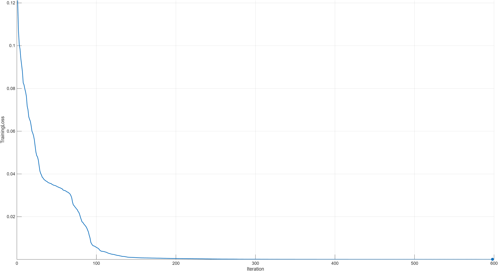
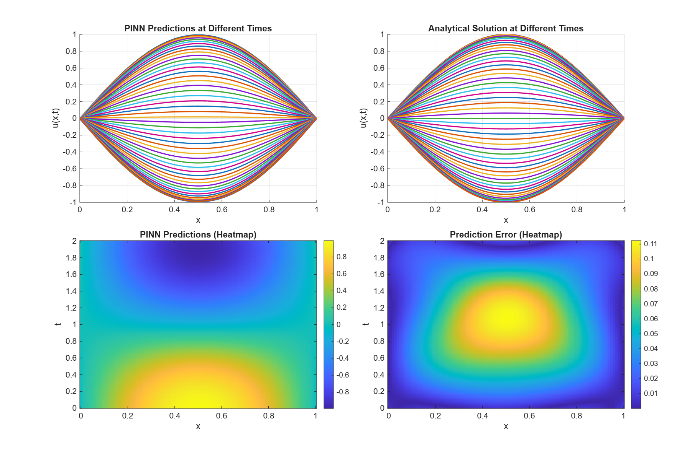

# 物理信息神经网络求解波动方程实验报告

## 一、实验目标
利用物理信息神经网络求解以下偏微分方程：

$$\frac{\partial^2 u}{\partial t^2} - c^2 \frac{\partial^2 u}{\partial x^2} = 0, \quad x \in [0, 1], t \in [0, 2]$$

其中波速 $c = 0.5$

**边界条件 (BC)**：
$$u(0, t) = 0, \quad u(1, t) = 0, \quad t \in [0, 2]$$

**初始位移条件 (IC1)**：
$$u(x, 0) = \sin(\pi x), \quad x \in [0, 1]$$

**初速度条件 (IC2)**：
$$\frac{\partial u}{\partial t}(x, 0) = 0, \quad x \in [0, 1]$$

**PDE的解析解**：

$$u(x,t) = \sin(\pi x) \cos(\pi c t) = \sin(\pi x) \cos(0.5\pi t)$$

## 二、理论分析

###  损失函数

$$\mathcal{L} = \mathcal{L}_f + \mathcal{L}_u$$

其中：
- $\mathcal{L}_f = \text{MSE}\left(\frac{\partial^2 u}{\partial t^2} - c^2 \frac{\partial^2 u}{\partial x^2}\right)$ 为PDE约束损失
- $\mathcal{L}_u = \text{MSE}(u_{\text{pred}} - u_{\text{exact}})$ 为边界和初始条件损失

### 网络架构

- **输入层**：2个特征（$x$, $t$）
- **隐藏层**：6个块，每块包含：
  - 全连接层（32个神经元）
  - Tanh激活函数
- **输出层**：1个神经元（预测 $u(x,t)$）

## 三、训练过程

### 3.1 训练配置

| 参数 | 值 |
|------|-----|
| 优化器 | L-BFGS |
| 最大迭代次数 | 2000 |
| 内部配置点数 | 8000 |
| 边界条件点数 | 30×2 |
| 初始条件点数 | 50 |
| 梯度容差 | 1e-5 |
| 步长容差 | 1e-5 |

### 3.2 训练结果

**相对误差：8.655054e-02 (≈ 8.66%)**

训练过程中损失函数显著下降，表明网络成功学习了波动方程的解。

## 四、预测结果

**图表说明**：
- **左上图**：PINN在不同时刻的预测结果
  
- **右上图**：解析解在不同时刻的结果
  
- **左下图**：PINN预测的热力图
  
- **右下图**：预测误差的热力图

## 五、附件

- `3220102895.mat`：PINN预测的201×101矩阵结果
- `wave_equation_results.png`：预测结果可视化（4子图）
- `train_loss.png`：训练过程中的损失曲线

