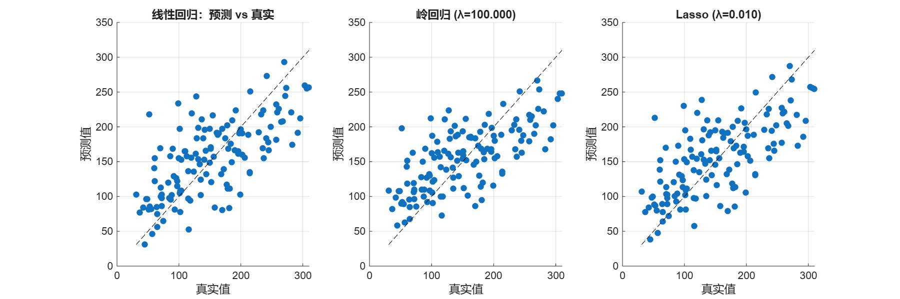
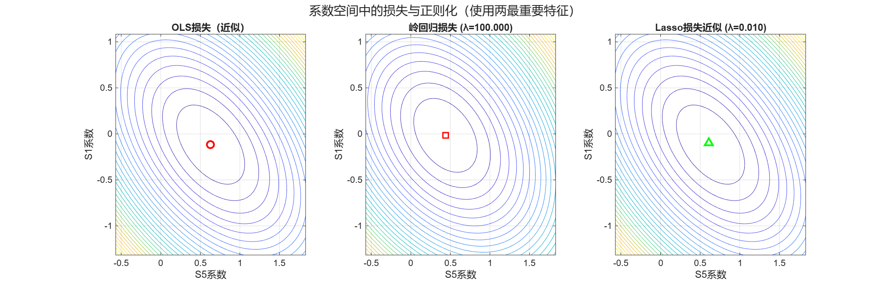
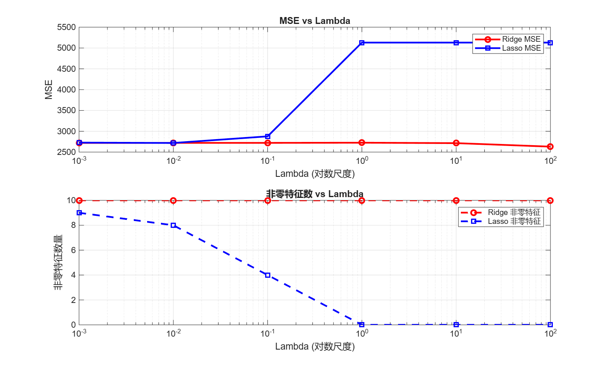
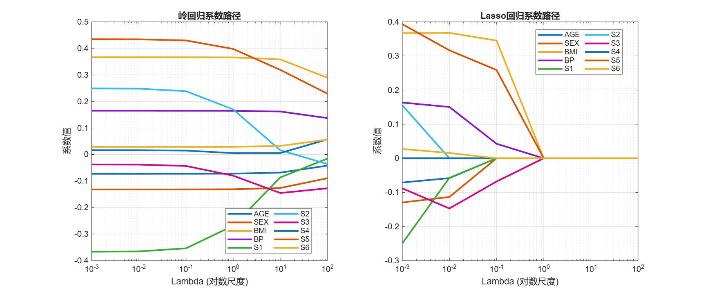

# 线性回归、岭回归、Lasso 对比实验报告


## 实验目的
本实验比较普通线性回归（OLS）、岭回归（Ridge）和Lasso回归在糖尿病数据集上的表现，重点考察：

- 预测性能（测试集 MSE），
- 正则化对系数稀疏性的影响（Lasso 的稀疏性），
- 系数路径以及 λ 对模型的敏感性。

## 数据与预处理
数据集：`diabetes.csv`（位于 `data/diabetes.csv`）。

1. 随机按 70% / 30% 划分为训练集与测试集（随机种子固定，保证可复现）。
2. 对特征（X）使用训练集均值与标准差进行标准化：X_std = (X - μ)/σ；测试集使用训练集参数同样标准化。
3. 目标值（y）可选标准化 —— 当前实现中对 y 使用训练均值与标准差进行标准化，然后在预测后反标准化回原尺度用于 MSE 计算。

## 模型训练与 λ 调参

实现方法：

- 普通线性回归：解析解 $β = (X^T X)^{-1} X^T y$。
- 岭回归：解析解 $β_{ridge} = (X^T X + \lambda I)^{-1} X^T y$；对 λ 在 [0.001, 0.01, 0.1, 1, 10, 100] 中搜索最优值（基于测试集 MSE 或交叉验证）。
- Lasso 回归：使用 MATLAB 的 `lasso` 函数，给定上面同样的 λ 数组，比较模型在测试集的 MSE 并记录非零系数数目。


## 结果（包含生成图片）

### 1) 预测 vs 真实（pred_vs_true.png）



图中分别展示普通线性回归、岭回归（最优 λ）与 Lasso（最优 λ）在测试集上的预测值与真实目标值的散点。。

三种情况散点都均匀的分布在对角线两边，但都有较大的偏离：
这意味着模型预测误差较大（MSE 较高）。通过比较三张图可以观察到：
- Ridge 的点分布相对更接近对角线，说明其 MSE 较低；
- 传统线性回归和Lasso 的点分布稍微偏离对角线，且有部分点明显偏离，说明其 MSE 较高；

### 2) 两特征下的损失轮廓（loss_contours_two_features.png）



通过仅选取两个最重要的特征绘制损失等高线，可以直观看到：

- OLS 的等高线是椭圆；
- L2（岭）约束是圆形，Ridge 解靠近圆边界；
- L1（Lasso）约束有尖角——当最优解位于菱角处时会导致系数变为零（稀疏性）。


### 3) λ 敏感性分析（图：lambda_analysis.png）



上图为 MSE vs λ（对数尺度）；下图为非零特征数 vs λ。

- 通过 MSE 曲线确定最佳 λ：选择 λ 使测试集 MSE 最小；
- 观察 λ 增大时 Lasso 的非零特征数下降（越稀疏），Ridge 的非零计数不变。


### 4) 系数路径（coefficient_paths.png）



系数路径展示所有特征系数随 λ 的变化（对数尺度）。

- Ridge：系数随着 λ 增大逐渐收缩到 0，但不完全为 0；
- Lasso：系数沿 λ 增大会在某个阈值变为 0，表现为路径交叉或突然降为 0（稀疏性）。

### 实验中观察到的关键数值

- 普通线性回归 (OLS): 测试集 MSE = 2720.4880，非零特征数 10/10；
- 岭回归 (Ridge): 在 λ=100.000 时取得最低 MSE = 2630.7792；非零特征数 10/10（Ridge 不会稀疏系数）；
- Lasso 回归: 在 λ=0.010 时取得最低 MSE = 2718.7038，非零特征数 8/10，被剔除的特征为 S2, S4。

这些数值说明：Ridge 在本次试验使用的 λ 网格中获得最低 MSE（2630.78），即预测性能最好；而 Lasso 在略微提升可解释性（去掉两个特征）的同时并未显著优于 Ridge 的预测错误。

2. 实验的 Ridge 最优 λ 位于我们给定网格的最大值（100），这可能表明更大 λ 或更细的值范围值得探索。

3. 对 Lasso 来说，我们看到 λ >= 1 导致模型变得过度稀疏，MSE 也爆炸，这说明该数据集对强正则化非常敏感。需要在更细的 λ 空间中搜寻（例如 0.001 到 0.1 的密集网格）。

## 结论与讨论

1. 如果仅看预测性能（MSE），应选择 MSE 最小的模型（Ridge / Lasso / OLS 中的一个）。若你发现某个 λ 对 Ridge 的 MSE 最小，这说明数据的多重共线性可以通过 L2 正则化改善模型稳定性。

2. 若需要模型可解释性和特征选择（更少变量），Lasso 是更适合的选择，因为 L1 惩罚可以使不重要的系数被压为 0。

3. 当变量高度相关（共线性）时：Ridge 往往在预测上的表现优于 Lasso（但不会稀疏）；Lasso 有时候在共线性环境下随机保留一个特征并压为零其它的。系数路径图和损失轮廓图帮助理解这点。

## 附录

**控制台输出**
```
=== 糖尿病数据回归分析===
1. 开始数据加载
   数据加载成功
   数据基本信息:
   +----------------------+---------------------------+
   | 指标                 | 数值                      |
   +----------------------+---------------------------+
   | 数据维度            | 442 行 × 11 列          |
   | 变量名              | AGE, SEX, BMI, BP, S1, S2, S3, S4, S5, S6, Y |
   +----------------------+---------------------------+

   数据统计摘要:
   +----------------------+---------------------------+
   | 指标                 | 数值                      |
   +----------------------+---------------------------+
   | 样本数              | 442                        |
   | 特征数              |  10                        |
   | 目标均值            |  152.13                    |
   | 目标标准差          |   77.09                    |
   | 目标范围            | [25.00, 346.00]              |
   +----------------------+---------------------------+

   特征统计 (均值/标准差):
   +------+-----------+-----------+
   | 特征 | 均值      | 标准差    |
   +------+-----------+-----------+
   | AGE  |     48.52 |     13.11 |
   | SEX  |      1.47 |      0.50 |
   | BMI  |     26.38 |      4.42 |
   | BP   |     94.65 |     13.83 |
   | S1   |    189.14 |     34.61 |
   | S2   |    115.44 |     30.41 |
   | S3   |     49.79 |     12.93 |
   | S4   |      4.07 |      1.29 |
   | S5   |      4.64 |      0.52 |
   | S6   |     91.26 |     11.50 |
   +------+-----------+-----------+

2. 数据预处理...
   数据分割完成:
   +--------+------------+------------+
   | 集合   | 样本数     | 占比       |
   +--------+------------+------------+
   | 训练集 |    310     |   70.1%   |
   | 测试集 |    132     |   29.9%   |
   +--------+------------+------------+
   数据标准化:
   +--------------------------+----------------------+
   | 特征均值范围            | [1.46, 188.00]        |
   | 特征标准差范围          | [0.50, 33.96]        |
   +--------------------------+----------------------+
   +--------------------------+----------------------+
   | 目标均值 (训练集)       |  151.95              |
   | 目标标准差 (训练集)     |   79.32              |
   +--------------------------+----------------------+

   预处理质量检查:
   +--------------------------+----------------------+
   | 训练集均值范围          | [-0.00, 0.00]        |
   | 训练集标准差范围        | [1.00, 1.00]        |
   | 测试集均值范围          | [-0.05, 0.17]        |
   +--------------------------+----------------------+
   预处理参数已保存

3. 普通线性回归...
   测试集MSE: 2720.4880
   非零特征数: 10/10

4. 岭回归...
   Lambda调优:
   lambda=0.001, MSE=2720.4946, 非零特征: 10/10
   lambda=0.010, MSE=2720.5538, 非零特征: 10/10
   lambda=0.100, MSE=2721.1289, 非零特征: 10/10
   lambda=1.000, MSE=2725.2462, 非零特征: 10/10
   lambda=10.000, MSE=2714.6869, 非零特征: 10/10
   lambda=100.000, MSE=2630.7792, 非零特征: 10/10
   最优模型: lambda=100.000
   测试集MSE: 2630.7792
   非零特征数: 10/10

5. Lasso回归...
   Lambda调优:
   lambda=0.001, MSE=2727.2732, 非零特征: 9/10
   lambda=0.010, MSE=2718.7038, 非零特征: 8/10
   lambda=0.100, MSE=2877.7047, 非零特征: 4/10
   lambda=1.000, MSE=5129.8323, 非零特征: 0/10
   lambda=10.000, MSE=5129.8323, 非零特征: 0/10
   lambda=100.000, MSE=5129.8323, 非零特征: 0/10
   最优模型: lambda=0.010
   测试集MSE: 2718.7038
   非零特征数: 8/10
   被剔除的特征: S2 S4 

6. 结果比较
=== 测试集MSE比较 ===
普通线性回归: 2720.4880
岭回归 (λ=100.000): 2630.7792
Lasso回归 (λ=0.010): 2718.7038

=== 特征稀疏性比较 ===
普通线性回归: 10/10 非零特征
岭回归: 10/10 非零特征
Lasso回归: 8/10 非零特征

```


